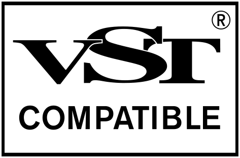

## Vst3SampleHost

このプロジェクトは、VST3プラグインをホストするサンプルホストアプリケーションのプロジェクトです。


## 機能

* VST3プラグインをロードできます。
* PCキーボードからプラグインにMIDIノートを送信して、波形合成できます。
    * PCキーボードのA, W, S, ..., L, P をピアノ鍵盤に見立てて、MIDIノートをプラグインに送信します。
    * Z と X キーでオクターブを変更できます
* マイク入力をプラグインに送信して、エフェクト処理できます。

## ビルド方法

Vst3SampleHostは、以下の環境でビルドできます。

* macOS 10.13.4 & Xcode 10.1
* Windows 10 & Visual Studio 2017
* Windows 10 & Visual Studio 2019

### 必須要件

* Java JRE (or JDK) version 8 or later (Gradleを使用するため)
* Git 2.8.1 or later
* CMake 3.14.1 or later
* Xcode 10.1 or later
* Visual Studio 2017 or later

### macOS環境でのビルドコマンド

```sh
cd ./ChapterXX/gradle

./gradlew build_all [-Pconfig=Debug]
# `config` プロパティはデフォルトで `Debug` が指定されます。リリースビルド時は、 `-Pconfig=Release` を指定します。

open ../build_debug/Debug/Vst3SampleHost.app
```

### Windows環境でのビルドコマンド

```bat
cd .\ChapterXX\gradle

gradlew build_all [-Pconfig=Debug] [-Pmsvc_version="..."]
: `config` プロパティはデフォルトで `Debug` が指定されます。リリースビルド時は、 `-Pconfig=Release` を指定します。
:
: `msvc_version` プロパティには、`"Visual Studio 16 2019"` または `"Visual Studio 15 2017"` を指定できます。
: デフォルトでは `"Visual Studio 16 2019"` が使用されます。
: そのため、Visual Studio 2017のみをインストールしている環境ではこのオプションに明示的に `"Visual Studio 15 2017"` を指定してください。
:
: 非英語ロケール環境でのビルド時に文字化けが発生する場合は、 `-Dfile.encoding=UTF-8` オプションを追加してください。

start ..\build_debug\Debug\Vst3SampleHost.exe
```

### TIPS

* サブモジュールのビルドが完了していてVst3SampleHost自体の再ビルドのみが必要な場合は、以下のようにコマンドを実行することで、不要なサブモジュールの再ビルドをスキップできます。

```sh
./gradlew prepare_app build_app [-Pconfig=Debug]
```

## ライセンスと依存ライブラリ

Vst3SampleHostのソースコードは MIT License で公開します。配布するバイナリにはさらに "Proprietary Steinberg VST3" license が適用されます。

Vst3SampleHostは以下のライブラリに依存しています。

* [wxWidgets](http://www.wxwidgets.org/)
* [PortAudio](http://www.portaudio.com/)
* [VST3 SDK](https://github.com/steinbergmedia/vst3sdk)
* [RtMidi](https://github.com/thestk/rtmidi)

## 商標について

VST is a trademark of Steinberg Media Technologies GmbH, registered in Europe and other countries.

</img>

## 連絡先

hotwatermorning@gmail.com

https://twitter.com/hotwatermorning

