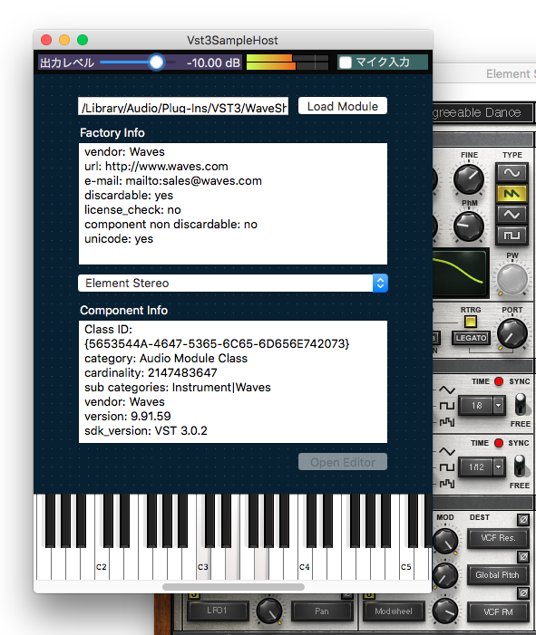

## Vst3SampleHost

[](https://dev.azure.com/vst3host-dev/vst3host-dev/_build/latest?definitionId=1&branchName=master)

このプロジェクトは、VST3プラグインをホストするサンプルホストアプリケーションのプロジェクトです。



## ダウンロード

最新のビルド済みパッケージは、以下のURLからダウンロードできます。

* [Win (MSVC2017)](https://vst3hostdev.blob.core.windows.net/vst3samplehost-release/refs/heads/update_ci_settings/vst3samplehost_release_win_msvc2017.zip)
* [Win (MSVC2019)](https://vst3hostdev.blob.core.windows.net/vst3samplehost-release/refs/heads/update_ci_settings/vst3samplehost_release_win_msvc2019.zip)
* [macOS (Xcode10.1)](https://vst3hostdev.blob.core.windows.net/vst3samplehost-release/refs/heads/update_ci_settings/vst3samplehost_release_osx_xcode10_1.zip)

#### 免責事項
@hotwatermorningは、このソフトウェアの使用によって生じたいかなる損害に対しても責任を負いません。

## 機能

* VST3プラグインをロードできます。
* PCキーボードからプラグインにMIDIノートを送信して、波形合成できます。
    * PCキーボードのA, W, S, ..., L, P をピアノ鍵盤に見立てて、MIDIノートをプラグインに送信します。
    * Z と X キーでオクターブを変更できます
* マイク入力をプラグインに送信して、エフェクト処理できます。

## ビルド方法

Vst3SampleHostは、以下の環境でビルドできます。

* macOS 10.13.4 & Xcode 10.1
* Windows 10 & Visual Studio 2017
* Windows 10 & Visual Studio 2019

### 必須要件

* Java JRE (or JDK) version 8 or later (Gradleを使用するため)
* Git 2.8.1 or later
* CMake 3.14.1 or later
* Xcode 10.1 or later
* Visual Studio 2017 or later

### macOS環境でのビルドコマンド

```sh
cd ./gradle

./gradlew build_all [-Pconfig=Debug]
# `config` プロパティはデフォルトで `Debug` が指定されます。リリースビルド時は、 `-Pconfig=Release` を指定します。

open ../build_debug/Debug/ChapterXX/Vst3SampleHost.app
```

### Windows環境でのビルドコマンド

```bat
cd .\gradle

gradlew build_all [-Pconfig=Debug] [-Pmsvc_version="..."]
: `config` プロパティはデフォルトで `Debug` が指定されます。リリースビルド時は、 `-Pconfig=Release` を指定します。
:
: `msvc_version` プロパティには、`"Visual Studio 16 2019"` または `"Visual Studio 15 2017"` を指定できます。
: デフォルトでは `"Visual Studio 16 2019"` が使用されます。
: そのため、Visual Studio 2017のみをインストールしている環境ではこのオプションに明示的に `"Visual Studio 15 2017"` を指定してください。
:
: 非英語ロケール環境でのビルド時に文字化けが発生する場合は、 `-Dfile.encoding=UTF-8` オプションを追加してください。

start ..\build_debug\Debug\ChapterXX\Vst3SampleHost.exe
```

### TIPS

* サブモジュールのビルドが完了していてVst3SampleHost自体の再ビルドのみが必要な場合は、以下のようにコマンドを実行することで、不要なサブモジュールの再ビルドをスキップして、プロジェクトファイルの再生成と指定したチャプターのVst3SampleHostの再ビルドを実行できます。

```sh
./gradlew prepare_project build_app_chapterxx [-Pconfig=Debug]
```

## ライセンスと依存ライブラリ

Vst3SampleHostのソースコードは MIT License で公開します。配布するバイナリにはさらに Proprietary Steinberg VST3 License と Steinberg ASIO SDK License が適用されます。

Vst3SampleHostは以下のライブラリに依存しています。

* [wxWidgets](http://www.wxwidgets.org/)
* [PortAudio](http://www.portaudio.com/)
* [VST3 SDK](https://github.com/steinbergmedia/vst3sdk)
* [RtMidi](https://github.com/thestk/rtmidi)
* [Catch2](https://github.com/catchorg/Catch2)

## 商標について

</img>

</img>

## 連絡先

hotwatermorning@gmail.com

https://twitter.com/hotwatermorning

